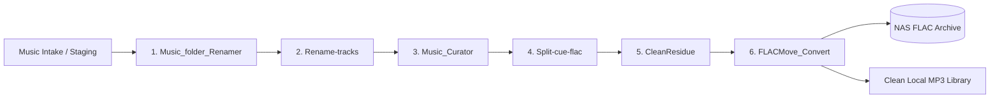

# All Six Skills Music Library Pipeline

Master orchestrator agent and automation workflow that chains together all 6 core music skills in the exact proven operational sequence:



---

## The 6 Pipeline Stages

1. **Music_folder_Renamer (`music_renamer.py`):**
   - Parses Vorbis comments (FLAC), ID3v2/ID3v1 tags (MP3), and CUE sheets.
   - Renames album folders into `<BandName> - <AlbumName> - <Year> - <Format>`.
   - Distinguishes formats (`- Flac`, `- mp3`, `- mp3 - Flac`) and handles `[Hi-Res]` markers and discographies.

2. **Rename-tracks (`rename_tracks.py`):**
   - Extracts artist, album, and track titles from audio tags and filename fallbacks.
   - Standardizes music filenames to `<BandName> - <AlbumName> - <TrackName>.<ext>`.
   - Updates `FILE "..." WAVE` references in any accompanying `.cue` sheets.

3. **Music_Curator (`music_curator.py`):**
   - Audits embedded cover art (preserves existing artwork; downloads high-res 1000×1000 art from iTunes / Deezer / CoverArtArchive if missing).
   - Classifies albums and tracks into 7 curated genres: `Hard Rock`, `Rock`, `Progressive Rock`, `Female`, `Jazz`, `Latina`, `Christmas`.

4. **Split-cue-flac (`split_cue_flac.py`):**
   - Scans for single large audio files (`.flac`, `.ape`, `.wav`) paired with `.cue` sheets.
   - Losslessly splits them into individual tracks with sample-accurate timing via FFmpeg.
   - Automatically deletes original unsplit image files upon verification (`--delete-originals`).
   - **Post-Split Standardization:** Automatically runs a follow-up pass of `Rename-tracks` and `Music_Curator` on newly split albums to ensure track names, cover art, and genre tags match library standards.

5. **CleanResidue (`clean_residue.py`):**
   - Retains only specified audio formats (defaults to `.mp3`, `.m4a`, `.flac`).
   - Eliminates redundant loose artwork (`.jpg`, `.png`), rip logs (`.log`), CUE sheets (`.cue`), scene info (`.nfo`), playlist files (`.m3u`), and text files (`.txt`).
   - Prunes empty subdirectories (`covers/`, `ArtWork/`, `Spectrograms/`, `Scans/`).

6. **FLACMove_Convert (`flac_move_convert.py`):**
   - **NAS Mirroring:** Syncs all `*- Flac*` album folders to the NAS backup directory via multi-threaded Robocopy (`/MT:16 /E /R:2 /W:5`).
   - **MP3 Downsampling:** Converts existing MP3s to LAME VBR preset `-q:a 5` (~128–130 kbps).
   - **FLAC Transcoding & Safe Deletion:** Transcodes FLACs to MP3 LAME VBR `-q:a 2` (~190 kbps) with metadata and embedded cover art preserved (`-c:v copy`). Deletes original local FLACs **only after** verifying non-zero MP3 output.
   - **Folder Renaming:** Renames album folders from `"- Flac"` to `"- mp3"`.

---

## Default Paths

- **Source Intake:** `G:\mp3-RawG`
- **NAS FLAC Archive:** `V:\My_FLAC_Collections`

*(Both paths can be customized via command-line arguments).*

---

## CLI Usage & Commands

The master orchestrator is located at [all_six_skills_music_pipeline.py](./scripts/all_six_skills_music_pipeline.py). A Windows batch shortcut is available at [all-six-skills-music-library.bat](./all-six-skills-music-library.bat).

### 1. Dry-Run Simulation (Recommended First)
Simulate all 6 steps without modifying or deleting any files on disk:
```powershell
python "$HOME/.gemini/config/skills/All_Six_Skills_Music_Library/scripts/all_six_skills_music_pipeline.py" --dry-run
```

### 2. Full Live Execution (Default Source & NAS Destination)
Processes `G:\mp3-RawG` and archives FLACs to `V:\My_FLAC_Collections`:
```powershell
python "$HOME/.gemini/config/skills/All_Six_Skills_Music_Library/scripts/all_six_skills_music_pipeline.py"
```
*(Or via batch shortcut: `& "$HOME\.gemini\config\skills\All_Six_Skills_Music_Library\all-six-skills-music-library.bat"`)*

### 3. Custom Source and NAS Destination
```powershell
python "$HOME/.gemini/config/skills/All_Six_Skills_Music_Library/scripts/all_six_skills_music_pipeline.py" "D:\New_Music_Intake" --dest-nas "\\elieserver\wd_18T\My_FLAC_Collections"
```

### 4. Resume from a Specific Step
If steps 1–3 have already completed, start directly from Step 4 (CUE splitting):
```powershell
python "$HOME/.gemini/config/skills/All_Six_Skills_Music_Library/scripts/all_six_skills_music_pipeline.py" --from-step 4
```

### 5. Run a Single Specific Step
Run only Step 3 (`Music_Curator`) or Step 5 (`CleanResidue`):
```powershell
python "$HOME/.gemini/config/skills/All_Six_Skills_Music_Library/scripts/all_six_skills_music_pipeline.py" --step 3
```

### 6. Keep Local FLAC Files (Skip Local Deletion)
Copies FLACs to the NAS and converts them to MP3, but preserves the original FLACs on the local drive:
```powershell
python "$HOME/.gemini/config/skills/All_Six_Skills_Music_Library/scripts/all_six_skills_music_pipeline.py" --keep-flac
```

---

## Safety & Data Protection Features

- **Safe Transcode Gate:** Local FLAC files are only deleted when FFmpeg finishes with exit code 0 and verifies that a valid non-empty MP3 was produced.
- **Pre-Clean Art Embedding:** Steps 2 & 3 guarantee album art is permanently embedded into file ID3/Vorbis tags before Step 5 purges loose artwork files.
- **High-Res Resiliency:** Includes an increased per-track timeout (600s) and configurable worker pool to handle massive 24-bit 192kHz audio files without timing out.
- **Virtualenv Auto-Discovery:** Automatically loads `mutagen` from candidate virtual environments if not installed in the global Python environment.
